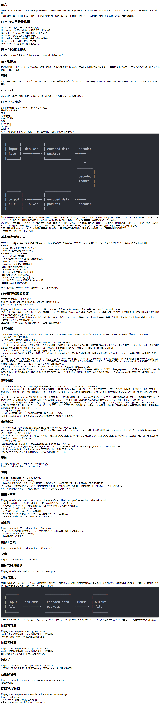

# FFmpeg音视频核心技术精讲与实战


### 音视频的广泛应用  
* 直播类：音视频会议、教育直播、娱乐/游戏直播等  
* 短视频：抖音、快手、小咖秀等  
* 网络视频：优酷、腾讯视频、爱奇艺等
* 音视频通话：微信、QQ、Skype等
* 视频监控
* 人工智能：人脸识别、智能音箱等、更关注算法

### 播放器架构
解复用（音视解码、视频解码）--> 音频播放、视频渲染-->音视频同步

#### 渲染流程
YUV-->渲染-->纹理-->交换-->窗口展示

### FFmpeg 下载、目录
```
git clone https://git.ffmpeg.org/ffmpeg.git
```
libavcodec:       存放各个encode/decoder模块，用于各种类型的声音/图像的编解码；  
libavdevice:      用于对输入/输出设备的支持；  
libavfilter:         滤镜，可用于裁剪视频，添加log等；  
libformat:          存放muxer/demuxer模块，用于各种音视频封装格式的生成和解析；  
libavresample:  混音和重采样；  
libavutil:            存放公共工具函数，包括CRC校验，整数开放，整数取对数，大小端格式转换，内存分配等功能；  
libavpostproc:   用于后期效果处理；  
libswscale:    实现了色彩转换和缩放功能；  




[linux-vim](http://www.runoob.com/linux/linux-vim.html)

[史上最全Vim快捷键键位图 — 入门到进阶](http://www.runoob.com/w3cnote/all-vim-cheatsheat.html)  


### C 语言基础
clang -g -o testfunc testfunc.c
./testfunc