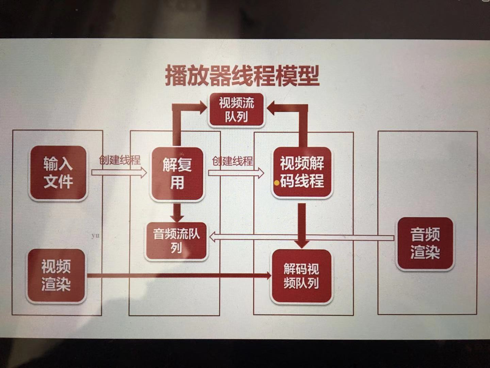

# 播放器实践  
player2  
  
* 该播放器只实现视频播放  
* 将FFmpeg与SDL结合在一起  
* 通过FFmpeg解码视频数据  
* 通过SDL进行渲染  

player3  

* 可以同时播放音频与视频  
* 使用队列存放音频  


## 多线程与锁  
#### 为啥要用多线程  
* 多线程的好处：充分利用cpu的资源  
* 多线程带来的问题：管理问题  

#### 线程的互斥与同步  
* 互斥  
* 同步  

#### 锁的种类 
* 读写锁
* 自旋锁
* 可重入锁  

#### SDL线程的创建  
```
SDL_CreateThread
SDL_WaitThread 
```

#### SDL锁  
```
SDL_CreateMutex/SDL_DestroyMutex  
SDL_LockMutex/SDL_UnlockMutex
```

#### SDL条件变量
```
SDL_CreateCond/SDL_DestroyCond
SDL_CondWait/SDL_CondSignal  
```

#### 播放器线程模型


见 player4

#### 线程的退出机制  
* 主线程接受退出事件
* 解复用线程在循环分流时对quit进行判断
* 视频解码线程从视频流队列中取包时对quit进行判断
* 音频解码从音频队列中取包时对quit进行判断
* 音视循环解码时对quit进行判断
* 在收到信号变量信息时对quit进行判断


## 音视频同步  

#### 时间戳  
* PTS： Presentation timestamp  ==> 渲染
* DTS： Decoding timestamp  ==> 解码 
* I(intra)/B(bidirectional)/P(predicted)帧

#### 时间戳顺序
* 实际帧顺序： I B B P 
* 存放帧顺序： I P B B 
* 解码时间戳： 1 4 2 3
* 展示时间戳： 1 2 3 4

#### 从哪获得PTS
* AVPacket 中的 PTS
* AVFrame 中的 PTS
* FFMpeg 方法
```
av_frame_get_best_effort_timestamp()
```

#### 时间基
* tbr：帧率
* tbn: time base of stream
* tbc: time base of codec

#### 计算当前帧的PTS 
```
PTS = PTS * av_q2d(video_stream->time_base)

av_q2d(AVRotional a)
{
return a.num/(double)a.den;
}
```


#### 计算下一帧的PTS
* video_clock: 预测的下一帧视频的PTS
* frame_delay: 1/tbr  
* audio_clock: 音频当前播放的时间戳   

#### 音视频同步方式
* 视频同步到音频
* 音频同步到视频
* 音频和视频都同步到系统时钟

#### 视频播放的基本思路
一般的做法，展示第一帧视频帧后，获得要显示的下一视频帧的PTS，然后设置一个定时器，当定时器超时后，刷新新的视频帧，如此反复操作。

代码实例见：player5.c
运行：
 
```
clang -g -o player5 player5.c `pkg-config --cflags --libs sdl2 libavutil libavformat libavcodec libstream`
```


